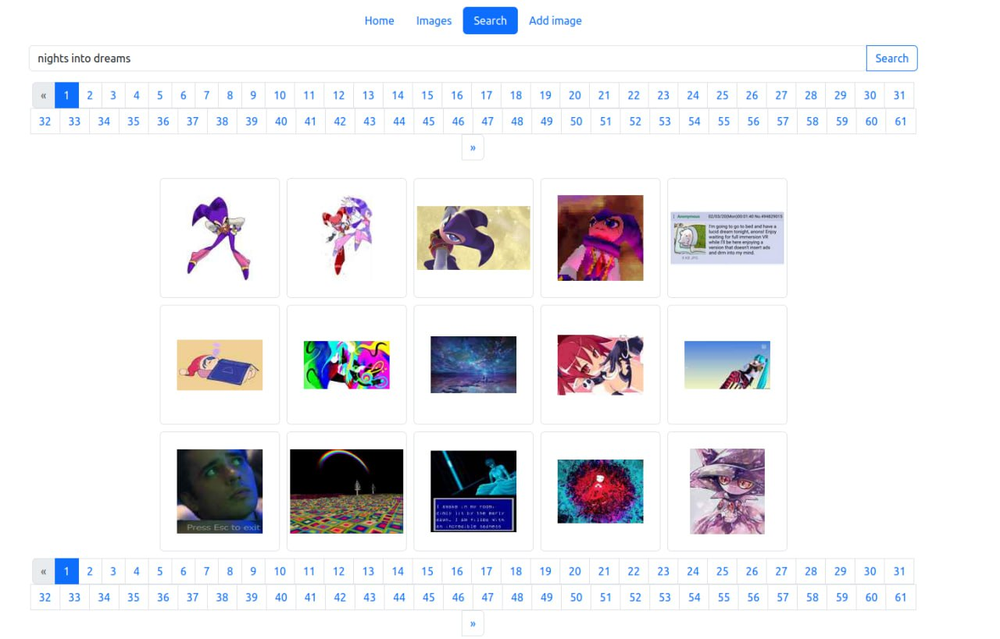

# CLIP search
A web app for searching through a set of images, utilizing OpenAI CLIP.

The interface displays search results for "Nights into Dreams" (a video game). The main character of the game can be seen in the first four results. Tested on a set of ~900 images, the zero-shot capabilities of OpenAI CLIP are impressively demonstrated here.

## Features
- Add an image to the set by URL  
- Search images by text description  

## How it works
- The images are not stored, only their URLs and CLIP embeddings.
- Image embeddings are stored in a postgres database with the [pgvector](https://github.com/pgvector/pgvector) extension, which allows vector similarity search.   

See [https://github.com/pl553/clipsearch_backend](https://github.com/pl553/clipsearch_backend) for details
